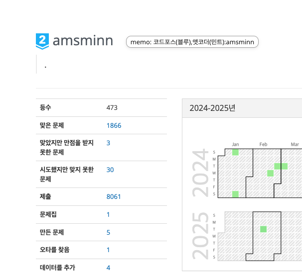

# chrome-boj-user-memo-extension

[백준 온라인 저지(BOJ)](https://www.acmicpc.net/) 유저 정보를 편리하게 메모할 수 있는 **Chrome 확장 프로그램**입니다.



--- 

### 설치 및 빌드

1. **저장소 클론 및 의존성 설치**
   ```bash
   git clone https://github.com/amsminn/chrome-boj-user-memo-extension.git
   cd chrome-boj-user-memo-extension
   pnpm install

2. **빌드**
    ```bash
    pnpm run build
    ```

--- 

### 사용 방법

1. **크롬에 로그인 권장**

    - 매모 동기화를 위해 크롬 로그인을 활성화한 상태로 사용하는 것이 좋습니다.

2. **백준 유저 프로필 페이지 접속**
(ex.https://www.acmicpc.net/user/amsminn)
    
    - 프로필 페이지에 접속하면, 확장 프로그램의 매모 기능을 사용할 수 있습니다. 

3. **확장 프로그램 팝업에서 메모 등록**
    
    - 확장 프로그램 아이콘을 클릭하여 팝업을 열기
    - 텍스트 입력란에 메모를 작성 후 업데이트 버튼 클릭
    - 문자열을 입력 후 업데이트를 누르면 기존 메모가 삭제됩니다.